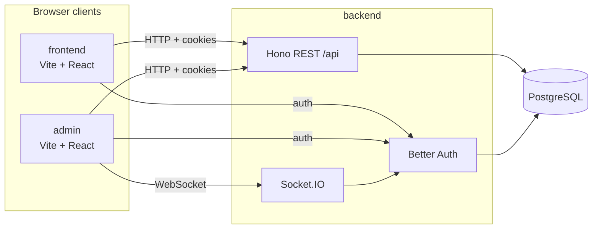

# Fullstack Turbo Kit

A production-ready [Turborepo](https://turbo.build/repo) monorepo starter with full-stack applications and shared packages.

## What's Inside?

### Apps

- **backend** — [Hono](https://hono.dev/) API server with [Better Auth](https://better-auth.com/), [Prisma](https://www.prisma.io/), and [Socket.IO](https://socket.io/)
- **frontend** — [Vite](https://vitejs.dev/) + [React](https://react.dev/) application
- **admin** — Vite + React admin application (real-time logs via WebSockets)

### Packages

- **@repo/database** — Prisma schema, migrations, and `createPrismaClient` factory
- **@repo/auth** — Better Auth `createAuth` factory (shared by backend and e2e)
- **@repo/utils** — Shared utility functions, Zod schemas, and Socket.IO types
- **@repo/typescript-config** — TypeScript configurations
- **@repo/ui** — Shared UI components and design system

All packages and apps are written in [TypeScript](https://www.typescriptlang.org/).

## Architecture



| Connection                 | Protocol              | Purpose                           |
| -------------------------- | --------------------- | --------------------------------- |
| frontend / admin → backend | HTTP (`/api/*`)       | REST API, health checks           |
| frontend / admin → backend | HTTP (Better Auth)    | Sign-in, sessions, cookies        |
| admin → backend            | WebSocket (Socket.IO) | Real-time admin rooms (e.g. logs) |
| backend → PostgreSQL       | Prisma                | Persistence                       |

In development, apps run separately via Turbo (`bun run dev`). The backend listens on `BACKEND_PORT` (default `3000`); frontend and admin use Vite dev servers. Socket.IO shares the backend HTTP server and allows CORS from `FRONTEND_URL` and `ADMIN_URL`.

For a full local stack in containers, see [docker-compose.yml](./docker-compose.yml) (Postgres + all three apps).

## Getting Started

Install dependencies:

```bash
bun install
```

Check that your environment variables are set up correctly:

```bash
bun run env:validate
```

Start the development database (PostgreSQL):

```bash
bun run docker:db
```

Migrate the database:

```bash
bun run prisma:migrate
```

Generate the Prisma client:

```bash
bun run prisma:generate
```

Run all apps in development mode:

```bash
bun run dev
```

Default URLs in development:

| App      | URL                   |
| -------- | --------------------- |
| Backend  | http://localhost:3000 |
| Frontend | http://localhost:5173 |
| Admin    | http://localhost:5174 |

## Environment variables

Configuration is managed with [Varlock](https://varlock.dev/). Schemas are the source of truth; run `bun run env:generate` after changing them to refresh TypeScript types.

| File                                                     | Scope                                                                          |
| -------------------------------------------------------- | ------------------------------------------------------------------------------ |
| [.env.shared](./.env.shared)                             | Ports, `APP_ENV`, and public URLs (`BACKEND_URL`, `FRONTEND_URL`, `ADMIN_URL`) |
| [apps/backend/.env.schema](./apps/backend/.env.schema)   | `DATABASE_URL`, `BETTER_AUTH_SECRET`                                           |
| [apps/frontend/.env.schema](./apps/frontend/.env.schema) | Imports shared schema only                                                     |
| [apps/admin/.env.schema](./apps/admin/.env.schema)       | Imports shared schema only                                                     |

## First admin user

After the database is migrated and the backend can connect, create the first admin account:

```bash
bun --filter backend add-admin -- "Admin User" admin@example.com your-secure-password
```

The script signs up the user via Better Auth, sets `role` to `admin`, and marks the email as verified. If the email already exists, it exits without changes.

Requires the same env as the backend (`DATABASE_URL`, `BETTER_AUTH_SECRET`, etc.). Run `bun run env:validate` from the repo root first if unsure.

## Deployment

Deployments use GitHub Actions, Docker Hub, and [Dokploy](https://dokploy.com/). Images are built from each app’s `Dockerfile` at the monorepo root.

### Staging

| Trigger                                      | What happens                                                                                                                            |
| -------------------------------------------- | --------------------------------------------------------------------------------------------------------------------------------------- |
| Push to `main` (or manual workflow dispatch) | CI → build `admin`, `backend`, `frontend` with `APP_ENV=staging` → push `*:staging` and `*:<sha>` tags → Dokploy staging deploy per app |

Configure GitHub secrets: `DOCKERHUB_USERNAME`, `DOCKERHUB_TOKEN`, `DOKPLOY_DOMAIN`, `DOKPLOY_API_KEY`, and `DOKPLOY_STAGING_{ADMIN,BACKEND,FRONTEND}_APP_ID`.

### Production

| Trigger                                         | What happens                                                                         |
| ----------------------------------------------- | ------------------------------------------------------------------------------------ |
| Git tag `admin@*`, `backend@*`, or `frontend@*` | Build single app image → push `:latest` and `:<version>` → Dokploy production deploy |

Web apps are built with `APP_ENV=production`. The backend image does not pass `APP_ENV` at build time; set runtime env in Dokploy (database, secrets, URLs).

Production releases typically use [Changesets](https://github.com/changesets/changesets): `bun run release:prepare`, then `bun run release:version` and `bun run release:push`.

Configure GitHub secrets: same Docker Hub and Dokploy keys, plus `DOKPLOY_PROD_{ADMIN,BACKEND,FRONTEND}_APP_ID`.

Workflow definitions: [.github/workflows/staging.yml](./.github/workflows/staging.yml), [.github/workflows/production.yml](./.github/workflows/production.yml).
